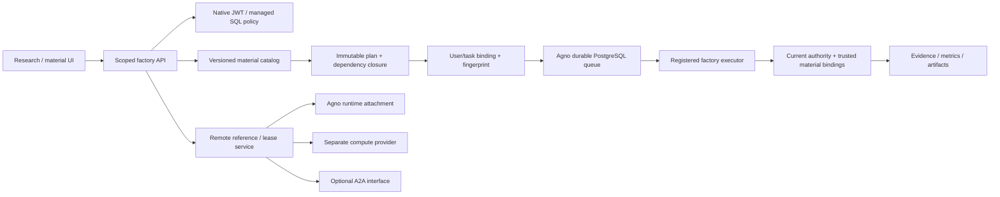

# Architecture

The engine is Agno AgentOS 3.1.0 with PostgreSQL. The original React UI consumes `/api/factory`; there is no commercial Control Plane code or second agent loop. See [the native envelope decision](decisions/0001-native-plan-envelope.md).

Factory metadata stores material versions, immutable plan snapshots, trusted owner/session/native-run bindings, admission fingerprints, application events, effect receipts and artifact bytes. Agno owns run/session state, queue claims, heartbeat/recovery, model/tool loop, native HITL and cancellation. Application status derives from native state plus explicit effect/domain evidence; it is not a replacement scheduler. Unknown receipts/effects retain capacity.

Native explicit-version and factory-resolved runs did not obtain durable tickets in the verified upstream revision. One static executor closes this gap through public callable instructions/tools and hooks. Serializable queue session state references the server-owned persisted plan. Snapshot integrity and owner/session/run identities are checked; later catalog publication cannot mutate a running plan. Ordinary pre-hook exceptions are insufficient. Agent pre-hooks use native InputCheckError; Function tool pre-hooks require StopAgentRun (AgentRunException), because they swallow InputCheckError. Actual native side-effect spies verify denial precedes compute and artifact writes. Every protected tool independently rechecks current native rights and task authority.

Admission serializes semantic fingerprints and shared task budgets transactionally. Plan construction shares its metadata transaction connection, avoiding nested pool acquisition while holding an advisory lock. A native receipt is bound to the pre-existing task. If a process dies after reservation or a response is missing, inspect/reconcile authoritative state; never automatically resubmit or free capacity after a timeout.

Questions and confirmations are distinct native requirements. UI actions carry actual requirement IDs plus a canonical version token. Stale, cross-owner, canceled or wrong-type decisions are rejected. Continuation sends native tool execution objects, preserving their IDs. A canceled ticket is not proof remote/experiment work stopped; bounded local tools settle cancellation only after owned compute cleanup.

Approved immutable application definitions drive bounded composition and exact permitted material choices. One stable native model dispatcher creates a fresh registered Model per response context; model, tool, knowledge and environment bindings come from the persisted plan, with current owner connections and authority rechecked. No shared executor Model mutation, application-ID branch, installer or fallback grants execution. Demo adapters replace only provider responses and use invented literature. Experiments execute one reviewed fixed Python program; user/model text cannot become executable code. ORX discovery is registered through an operator-provided task adapter; controlled native integration passes, while live model research and production isolation remain unverified. The opt-in actual ORX application uses the real pinned CLI with a task-exclusive local project/store, four sealed original toy files and a persistent single-launch intent; see ORX_LOCAL_EXPERIMENTS.md. See MATERIAL_ASSEMBLY.md.

Remote attachment does not allocate a machine. Resource references resolve through operator configuration and current owner grants, with target fingerprints, lease heartbeats, remote IDs and snapshot reconciliation. No native durable cursor/boot epoch is invented. A2A is a future interoperability adapter, not environment provisioning. The remote lease and trusted prepare/dispatch APIs are implemented. A selected receiver owns the entire task tree and one native ticket; the origin holds metadata only. Separate local native services and databases verify routing/cancellation/evidence. Production provider/TLS/identity/endpoint acceptance remains open.

Deploy one application process and its bounded native worker pool on the proposed single server. Initial limits: two workers, two held tasks per user, twelve held tasks globally, twenty queued tickets, eight tool calls, bounded experiment time/output. Paused/UNKNOWN work retains its reservation. There is no permanent heavy environment per user. Local fixed compute has hard Windows job bounds and cleanup; full tenant isolation, aggregate CPU/RAM/PID measurement and sustained fair throughput remain deployment work. Twenty-user concurrent admission/cancel/revoke/UNKNOWN tests and clean-stop restore have passed. Fact queries use the API/database directly.

Child tickets share persisted root and ancestor tool budgets, plus a four-descendant lifetime cap and depth two. Their immutable scope cannot become a standalone new root. A bounded trusted lifecycle observer performs existing-work cleanup without UI reads; it validates original native bindings and uses public native cancellation APIs. Pre-ACK children stay uncertain, and completed tickets are not re-authorized as active execution. Default running signals are single-process only; see LIFECYCLE.md. Group capacity is held until native terminal facts and known effect cleanup agree.

Scheduling composes Agno SchedulePoller with a guarded public executor interface, while AgentOS scheduler=False disables its unguarded executor. Native schedule ingress is blocked. The owner-scoped wrapper accepts only an immutable top-level plan reference and cron/timezone; occurrence receipts enter the same Store/native queue admission. Native polling and queue ownership remain upstream. See SCHEDULING.md for tested recovery and remaining lease/restart acceptance.

Material governance separates immutable content from publication state and review
receipts. The default requires a distinct current administrator. Catalog discovery,
admission, native tools and delegated ancestor guards require current approved
versions; the version remains available as historical evidence after withdrawal.
Factory event replay uses persisted task stream IDs, signed owner/task positions
and one SQL snapshot. Late lower-ID commits explicitly invalidate the prefix;
display history limits never erase application failure facts.

Governed remote execution persists a separate receiver binding proof instead of
rewriting source bindings or forwarding credentials. An exact operator mapping
selects receiver-owned adapters/connections; both current policies and source
authority over bounded authenticated HTTP gate execution. Receiver review occurs
before native admission, and descendants narrow the same root proof. Loopback
process/database acceptance and external-host production acceptance remain
distinct. See REMOTE_BINDINGS.md.

## Actual local experiment and usage accounting

The `local-orx-v1` contract adds five narrow registered tools for inspect, run,
wait, cancel and logs. One operator connection group resolves their exact
owner-bound handle; materials never contain paths, commands or credentials.
The no-provider workflow model selects only these approved native Functions.
After plan review, inspect binds the actual task/project/experiment/source and
native run intent. Native HITL separately confirms the sealed experiment launch.
Only real CLI operations create experiment/run records. Missing launch replies
reconcile the old run instead of submitting again. Downloaded result JSON and
the four-file recipe archive are integrity checked by the browser.

Lifecycle cleanup validates the original native ticket, immutable effect,
operator handle and environment limits even after a current execution grant
ends. It calls only reclaim, never provisioning or launch. Native terminal
state plus a Windows Job Object active-process count of zero establish stop;
unknown outcomes retain capacity. The selected profile applies job CPU,
memory, time and process limits, but is not hostile-code tenant isolation.

The usage ledger serializes admission across task/root/ancestor/user accounts
before each provider primitive. Approved currency, token/amount ceiling,
provider/model and price revision remain immutable. Actual trusted usage settles
even when authority ends after the response; partial/error/unknown usage keeps
its hold. Remote execution allocates the same original cap before dispatch and
requires authenticated original-grant attestation; cumulative authoritative
statements reclaim only proven unused allocation. Separate migrations preserve
legacy/source plan hashes. No paid adapter or real credentials are configured.
