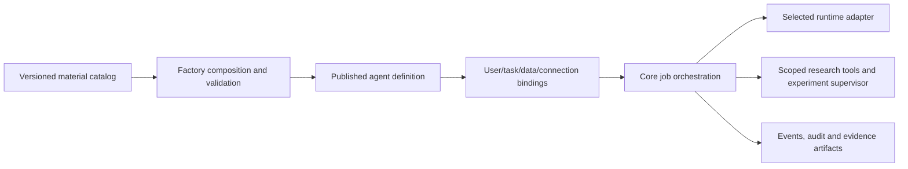

# Architecture and platform selection

This is the agreed product shape, with proposed implementation defaults. Existing open-source platforms are being evaluated before building a custom core.

## Material catalog

Skills, tools, prompts, knowledge, model policies and execution-environment specifications are reusable versioned materials. Each material records dependencies, compatibility constraints, permission needs, input/output schemas, provenance, license and revision. Credentials are invocation bindings, never shared materials. Uploads and external instructions are untrusted and cannot grant capabilities.

The manager assembles materials through a callable factory interface and UI. The callable workflow covers catalog/discovery, plan/preflight, instantiate, inspect and reclaim. Instantiation must be idempotent and recheck permission at execution time. The factory validates dependencies, compatibility, permissions and schemas, then freezes a reusable immutable definition revision. Published jobs keep the exact revision and material digests. New definition versions do not alter jobs already queued or running.

FR16 natural-language assembly is approved for the current full delivery. A natural-language demand produces a proposal by bounded selection from approved versioned materials, then undergoes dependency and permission preflight. Its default resource is a temporary task-scoped instance, not a newly published shared definition. Shared publication follows a separate administrator review path. Approval policy for temporary task plans remains unresolved; neither mandatory publication for every instance nor unlimited automatic execution is assumed. The model cannot grant additional permissions, register tools, create credentials or publish its own proposal. Parent-task delegation, shared budgets, depth/count limits, persistent parent/child links and safe child-resource reclaim remain acceptance requirements. These are planned capabilities, not functions enabled by the M1 foundation page.

## Core and invocation bindings

The core resolves trusted per-user connection references, data references and environment policy, creates an isolated task workspace and persists the job before queueing. Managers maintain definitions and operational policy; users submit jobs, clarify inputs, approve scoped actions and access their own outputs. Manager operational visibility does not automatically imply access to all user secrets or data.

The target is roughly 20 registered users. Proposed initial concurrency is 2 workers with a bounded queue. Scheduling includes durable delayed jobs and recurring schedules with explicit timezone. Job state, event cursors, approvals, session/experiment references and terminal outcomes survive restart. Recovery reconciles agent sessions and experiment supervisor state before resuming. Retries create attempts with linked provenance rather than overwriting evidence.

## Auto-Research application

Auto-Research is an agent definition assembled from catalog materials, not a replacement for the factory. Literature work captures query/source provenance, reading evidence, claim-to-citation links, exclusion reasons and uncertainty. Experiment work captures hypothesis, executable revision, dataset/seed, environment, resource limits, approval scope, evaluator and metric direction, run lineage, logs and artifact hashes. Chat completion alone is not research success.

The core owns runtime sessions. If OpenCode is selected, the ORX research tool adapter owns narrow portable retrieval/experiment contracts and delegates detached experiment supervision to ORX. The adapter does not start a second agent server. Cancellation must stop both the session and outstanding experiments; killing the launch CLI is insufficient. `orx agent spawn`/`orx exp wake` require ORX-owned sessions and cannot be reused directly for factory orchestration. OpenCode is a candidate, not a mandatory foundation under the corrected design baseline.

## Acceptance of reuse

Adopt or extend an existing complete platform first, then implement verified gaps. Evaluate candidates against catalog/composition, callable assembly, agent/runtime independence, version snapshots, scoped credentials, lifecycle/recovery, environment isolation, manager/user UI, deployment shape, licensing and customization cost. Select based on verifiable source capabilities rather than similar names or screenshots. Preserve this neutral scaffold and acceptance matrix while selection is pending. The complete v0.3 design must be mapped before a final platform decision; local transfer has not yet succeeded in this executor.

A second harmless synthetic agent profile must be composed from catalog materials and executed without modifying core orchestration. This demonstrates extensibility without importing private ConvertD or company workflows.
