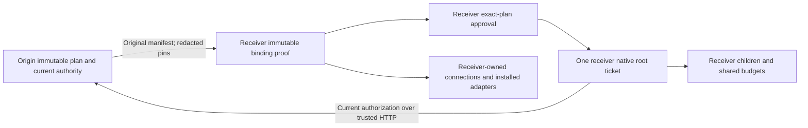

# Governed remote execution and receiver-local bindings

This stage adds explicit operator mappings and current origin authorization over
authenticated HTTP to the existing Factory handoff. The receiver owns its native
run and descendants. The origin holds one metadata reservation and creates no
native execution ticket. Default startup installs no remote target or mapping.

## Operator configuration and immutable proof

`Settings.handoff_targets` pins a `HandoffTarget` reference, endpoint, identity
map and configuration revision. `handoff_origins` pins a `TrustedOrigin` identity
map, current authority transport, tool contract and receiver ceilings.
`remote_binding_mappings` contains exact `TrustedRemoteBindingMapping` objects.
All three are same-process operator configuration; request bodies cannot install
a mapping, endpoint, adapter, credential, callable or owner grant.

A mapping names its immutable reference/revision, origin reference and owner,
receiver owner, binding kind, exact source spec and exact effective receiver spec.
Specs include material identity/version/hash, adapter ID/revision, inert config
and a redacted exact connection pin when required. Model, tool, knowledge and
environment mappings are supported. Mapping native tool names/material refs
cannot change, and connection requirements cannot be added or discarded.
Receiver tool connection capabilities must fit both the exact tool material
permissions and the source pin. Model and environment connection scopes are
constrained by their registered adapter's required capabilities and the exact
source/local pins; they are not implicitly limited by model or environment
material permissions.
Effective adapters must be explicitly installed and meet current local preflight.
Unmapped connectionless bindings use their exact installed adapter; a missing
adapter has no fallback. Every connection-bearing binding requires an explicit
mapping to an already bound receiver-owned connection. No account is inferred.

The original source manifest, its fingerprint, execution bindings, composition
anchor, goal, materials and budget remain unchanged in the receipt. Preparation
creates a separately persisted immutable receiver proof containing both owners,
receipt/origin-task/receiver-plan identities, original manifest hash, source
selected-target configuration revision/hash, receiver trust configuration
revision/hash and each exact mapping revision/hash/source/effective spec.
The imported receiver plan references that proof hash. Receiver plan identity,
owner, creation time and fingerprint are receiver-owned; source semantics stay
the same. The origin reconstructs and verifies the full proof digest from its
own saved source manifest plus the scoped receiver projection. Replays cannot
replace the original proof, plan, task or native ticket.

Operator mapping revisions are persisted independently. Rebinding a previously
used reference/revision with different content is rejected, including after
restart. Removing/rotating the mapping, adapter or local connection denies later
execution and preserves historical proof evidence. A connection handle resolves
only inside the receiver's `ConnectionService`; handles, credentials and provider
endpoints are never part of manifests, proofs, prompts or remote responses.
An operator must rotate configuration/handle revisions for a changed credential
principal or underlying account. Token refresh for the same scoped identity is
not authority to switch identities.

## Exact application distribution

The operator imports a complete reviewed source application body with
`ApplicationService.import_snapshot(actor, snapshot, request_id)`. This is a
trusted in-process operation; there is no user HTTP import endpoint. It preserves
the source ID/version/creation timestamp/SHA rather than rebuilding a similar
application with a different digest. Strict canonical schema, size, hash,
timezone-aware timestamp, manager-authored provenance and current receiver
administrator/material authority are required. A fresh imported version is a
receiver-local draft authored by the importer. The receiver then requests
publication and a different current administrator decides that exact version.
Source approval grants no receiver permission.

Identical bodies have an idempotent observation receipt. Existing local author,
review, publication, withdrawal and archive state is preserved. Changed request
intent, different bodies at an existing version and non-monotonic new versions
are rejected. Current administrator authority is required even on receipt replay.

## Current source authorization

`OriginAuthorityTransport` is an operator-installed synchronous, bounded HTTP
guard. It calls the optional `/api/factory/remote-authority/check` route, which is
installed only when origin targets are configured. The authenticated native
actor must be the receiver identity mapped by the originally selected target.
The body binds exact origin owner/task/manifest, target reference/revision/hash,
receiver identity and protected tool. The origin reads the persisted placement,
requires no local ticket, and runs its actual current plan policy, owner grants,
application/material publication, adapter and connection guards. It returns only
bounded current capabilities/tools/budgets or a separately verified cancellation
signal. There is no fixed-success authority response.

The receiver verifies exact response bindings, then intersects scope/budgets with
its trusted ceilings and current local approval. Timeout, unreachable origin,
wrong identity/configuration/hash, redirects, malformed/oversized/compressed
responses or withdrawn authority deny protected work. HTTP guards have finite
timeouts and no retry or environment proxy. They are synchronous within native
guard boundaries; throughput under origin latency is not benchmarked.

The origin target client also rejects non-loopback HTTP unless an explicit
in-process test transport is installed; cross-host targets require HTTPS. It
disables environment proxies and redirects, requests identity encoding, and
streams bounded bodies: 16 KiB errors, 2 MiB JSON and the configured artifact
ceiling. Compressed responses and oversized advertised/chunked bodies are rejected
before further reads. Only an allowlisted public protocol code can cross an error
boundary; private peer/provider messages are discarded. HTTPS is a transport
requirement, not evidence that a production host identity was approved.

Source unreachability is uncertainty, not proof of source revocation, cancellation
or stopped compute. Native/effect facts decide capacity release. Verified origin
cancel intent propagates its exact cleanup semantics; revocation/policy failure
cannot erase an earlier application failure or manufacture successful science.
Current read-only receipts/proofs and scoped cleanup do not resolve credentials
or require a withdrawn execution mapping. During origin outage, receiver native
job facts stay readable with execution/delegation actions disabled; local scoped
cancel remains available. A read cannot manufacture a stop proof or release a
paused/unknown native ticket.

## Two-sided review and receiver descendants

Both sides enforce their own exact plan policy. Under receiver administrator
review, prepare saves the exact receiver plan/proof and returns `PREPARING` with
`receiverReviewRequired`; no receiver task or native ticket exists yet. The UI
shows that specific waiting state. A current receiver administrator reviews the
receiver plan ID, whose fingerprint includes the immutable proof reference.
After approval, continuing the original source plan/target/request key performs
idempotent prepare and crosses the existing one-shot dispatch boundary. Native
tool confirmation remains a separate requirement.

Receiver descendants retain the root's exact application/material alternatives,
source connection pins and proof mapping. A child may select a permitted mode
with a material/tool/capability subset; it cannot recompose through a different
local account, enlarge authority or move servers. Actual persisted ancestry,
owner/task/native IDs, depth/count and shared budgets are rechecked. Root and
scoped-child cancellation use the receiver's existing native lifecycle APIs.
Unknown admissions/effects retain capacity. Artifact bytes, length and SHA-256
are checked against owner-scoped receiver metadata before return to the origin.
New remote artifact metadata distinguishes source and effective model/environment
adapters and revisions, both execution-binding hashes and the immutable receiver
proof hash. The `modelAdapterId`/`environmentAdapterId` fields identify effective
receiver adapters on these new records. Original manifests, artifact content and
historical metadata are not rewritten. Cascade reclaim may record canceled Factory
intent on an already finished descendant; its native COMPLETED fact, completion
events and artifact history remain available separately.

## Governed tool compatibility and acceptance limits

`legacy-v1` retains its exact four-tool contract and original policy/governance
hashes. The optional `registered-runtime-v1` contract includes `orx_discover` and
requires distinct plan/material policy revisions plus a distinct trusted origin
configuration revision. Publication, exact application closure, actual registered
adapters, local connection pins and both current policies must all pass. Demo or
`syntheticFixture` flags alone cannot authorize a registered production plan.

Acceptance uses actual loopback native HTTP services, independent processes,
generated PostgreSQL databases/workspaces and explicitly controlled providers.
Fixtures also exercise non-demo, non-synthetic, administrator-reviewed plans.
No real credential, paid model or external deployment is configured. These tests
establish the protocol/native ownership boundary; production identity issuance,
TLS/host authorization, cross-host isolation and live provider/science acceptance
remain separate pending decisions. One native process owns each service's local
cancellation signals. Multiple replicas of one receiver are not certified.

See [verification](VERIFICATION.md), [acceptance](ACCEPTANCE.md),
[handoff lifecycle](REMOTE_HANDOFF.md) and [security](SECURITY.md).
